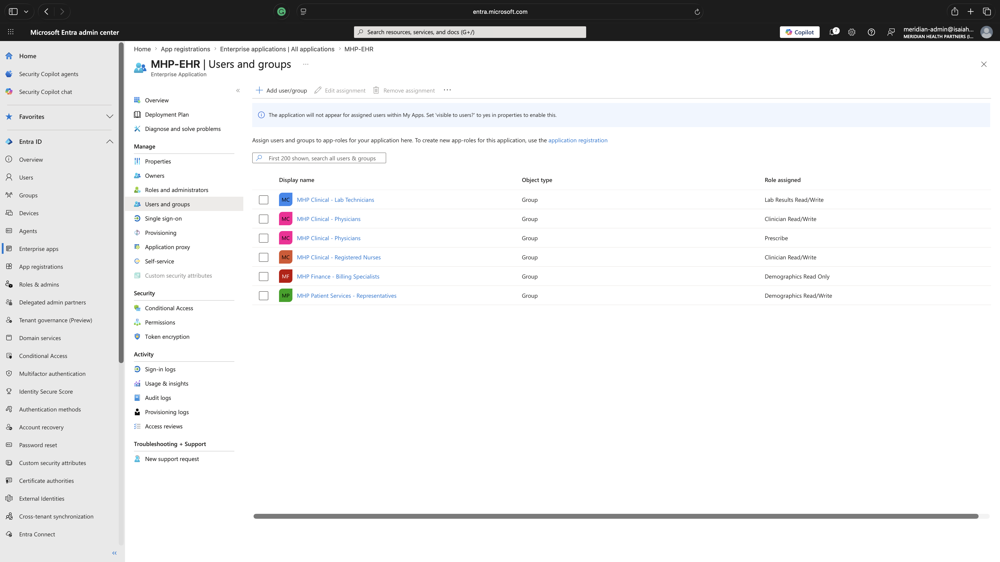
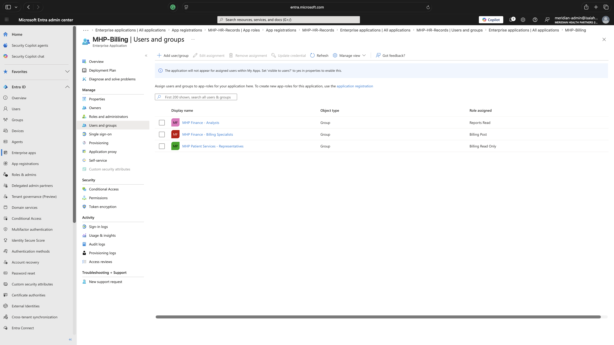
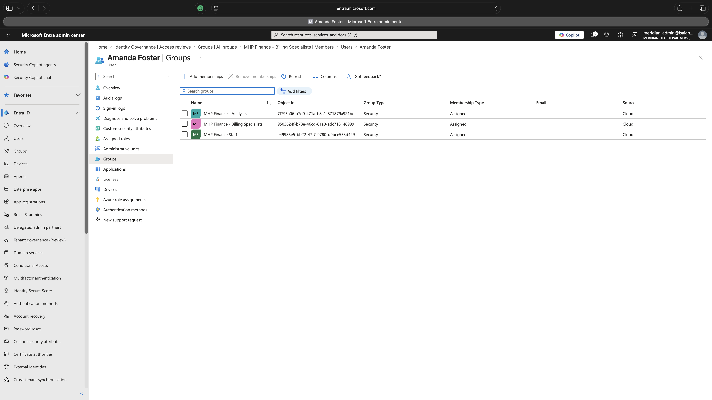
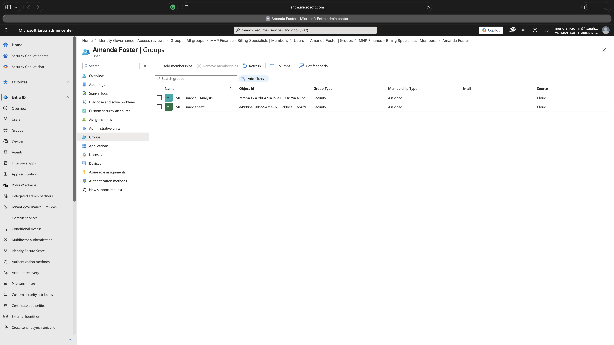
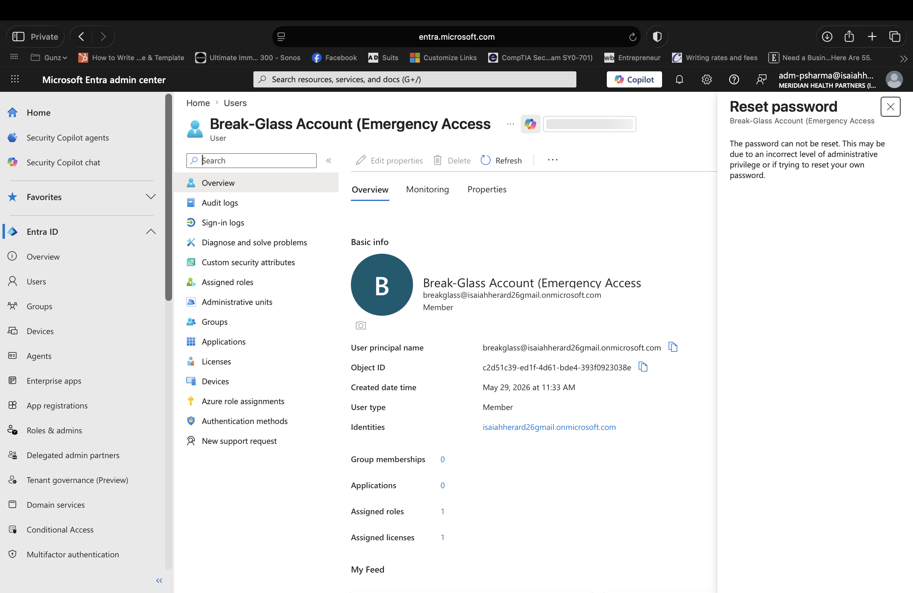
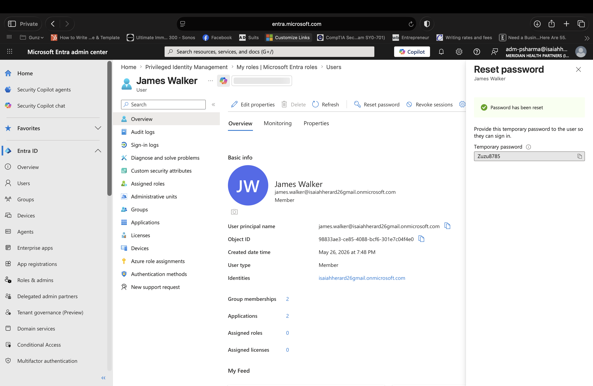

# Entra ID RBAC Design & Implementation — Meridian Health Partners

**Project 3 of 10** in my IAM Analyst portfolio. A role-based access control model built on Microsoft Entra ID for a fictional regional healthcare network — turning coarse department groups into a granular, least-privilege role catalog with application-level enforcement, separation-of-duties controls, validated access boundaries, and recurring recertification.

> Healthcare framing is deliberate. HIPAA's minimum-necessary standard forces strict least-privilege, and that's the bar I want this work judged against.

---

## Project context

Meridian Health Partners (MHP) is a ~520-employee healthcare network across three Pacific Northwest facilities — the consistent organization across all ten projects in this portfolio. Same tenant, same workforce, same compliance posture, so the projects read like a year of IAM work at one company rather than ten disconnected labs.

This project builds directly on the two before it:

- **[Project 1 — User Lifecycle / JML](https://github.com/ZayLinux26/entra-user-lifecycle-jml)** created the identity baseline: 15 users across six departments and the joiner/mover/leaver workflows, plus six department security groups.
- **[Project 2 — PAM Fundamentals](https://github.com/ZayLinux26/entra-pim-pam)** added the privileged tier — Tier 0/1 admin identities, just-in-time elevation, and PIM — and noted that a later RBAC project would formalize the broader workforce role catalog.

**This is that project.** Department groups like `MHP Clinical Staff` lump nurses, physicians, and lab techs together — fine for lifecycle work, too coarse for least privilege. RBAC goes one level finer: role groups *inside* each department, each granting only the access that role needs.

## What I built

**Eight role groups** layered on top of the existing department groups:

| Role group | Members | App access granted |
|---|---|---|
| MHP Clinical - Registered Nurses | Emily Rodriguez, David Rodriguez | EHR `Clinician.ReadWrite` |
| MHP Clinical - Physicians | Sarah Chen, Marcus Patel | EHR `Clinician.ReadWrite` + `Prescribe` |
| MHP Clinical - Lab Technicians | *(staffed on hire)* | EHR `LabResults.ReadWrite` |
| MHP Patient Services - Representatives | James Walker, Maria Lopez | EHR `Demographics.ReadWrite`, Billing `ReadOnly` |
| MHP Finance - Billing Specialists | *(staffed on hire)* | EHR `Demographics.ReadOnly`, Billing `Post` |
| MHP Finance - Analysts | Amanda Foster | Billing `Reports.Read` |
| MHP HR - Generalists | Karen O'Brien, Daniel Garcia | HR `HRRecords.ReadWrite` |
| MHP Administration - Approvers | Rachel Davis (COO) | HR `HRRecords.ReadOnly` |

**Three protected applications** registered in Entra, each with defined app roles: `MHP-EHR` (5 roles), `MHP-Billing` (3 roles), `MHP-HR-Records` (2 roles). Access is granted by assigning role groups to app roles — never by assigning individual users — so the Project 1 lifecycle workflows keep working unchanged (a role change is a group change).

Full machine-readable catalog: [`artifacts/role-catalog.csv`](artifacts/role-catalog.csv).

## Two design decisions worth calling out

**Administrators are not in role groups.** Jennifer Williams (Identity Operations Lead), Priya Sharma (IAM Analyst), Thomas Mitchell (Security Engineer), and Robert Kim (Senior System Administrator) run the platform — they don't need clinical, billing, or HR app access. They remain in the `MHP IT Staff` department group, and their privileged access is governed by PIM from Project 2. Putting any of them into a clinical or finance app role would be the exact over-privileging RBAC exists to prevent.

**A documented role-catalog gap.** Lisa Thompson is a Medical Assistant — clinical, but not a nurse, physician, or lab tech. Rather than force her into an ill-fitting group (an auditor would flag a Medical Assistant in an "RN" group), she was left in her department group and the gap was documented for a future catalog expansion. Role catalogs are never complete on day one; flagging gaps beats forcing bad fits.

## Separation of duties

Enforced through mutually exclusive group membership. The headline control: **Billing Specialists can post charges (`Billing.Post`); Finance Analysts can only read reports (`Reports.Read`); they are two different groups, so no single person can both create and reconcile a charge.** Clinicians carry no billing role (prevents upcoding); no workforce role carries a directory admin role (admin is JIT via PIM).

## Validation — I tested it and broke it on purpose

**Negative tests (boundaries hold):** the Users-and-groups assignment blades are the authoritative access record. They confirm nurses have no billing role, Billing has only read-only demographics in the EHR (minimum necessary), and Finance Analysts have `Reports.Read` but never `Billing.Post`. Absence from a role *is* the denial.

**Separation-of-duties test (seed → detect → remediate):** Amanda Foster (Finance Analyst) was deliberately added to the Billing Specialists group, giving her both `Reports.Read` and `Billing.Post` — a toxic combination. The violation was detected (the access review's purpose) and remediated by removing the conflicting membership, restoring her to a single role. Evidence captured at each stage.

## Evidence

| | |
|---|---|
|  | Each role group mapped to its specific EHR app role — the core least-privilege control |
|  | `Billing.Post` and `Reports.Read` on different groups — separation of duties |
|  | A toxic combination deliberately seeded for the SoD test |
|  | Violation detected and remediated — back to a single role |
|  | Helpdesk admin **blocked** from resetting a privileged account's password |
|  | Same helpdesk admin **allowed** to reset a standard user — least privilege, proven |

Full evidence set (group creation, membership, app roles, access review) is in [`screenshots/`](screenshots/), numbered 01–18.

## Troubleshooting & lessons learned

### Eligible vs. Active role assignments

While validating the Helpdesk password-reset boundary, the assigned Helpdesk Administrator (Priya Sharma) was initially unable to reset *any* user's password — including a standard, non-admin user. Expected behavior is that a Helpdesk Administrator can reset non-privileged users' passwords, so this pointed to the role not being effective.

**Root cause:** This tenant has Privileged Identity Management enabled (from Project 2 – PAM). The role was granted as an *eligible* assignment rather than an *active* one. An eligible assignment confers no standing permissions — the holder has zero access until they activate the role just-in-time through PIM.

**Resolution:** activated the Helpdesk Administrator role via PIM (My roles → Helpdesk Administrator → Activate). After activation and a fresh sign-in, the role behaved as expected — password reset succeeded on the standard user and was blocked on the privileged account.

**Lesson:** in a PIM-governed environment, *role assignment is not role access*. Eligible roles must be activated before they take effect. What first looked like a misconfiguration was actually least privilege working as designed — standing privilege had been eliminated, exactly the control Project 2 set out to enforce. This is why RBAC and PAM are designed together: the role catalog defines *what* a role can do, while PIM governs *when* that capability is live.

### Duplicate app registrations

The HR app was accidentally registered multiple times, leaving five identical `MHP-HR-Records` enterprise applications. Resolved by identifying the registration holding the correct app roles, deleting the duplicates from App registrations (which also removes their enterprise apps), and verifying the tenant was back to three clean applications. Registration hygiene is real operational work.

## Results

- 8 role groups mapped to 3 protected applications across 10 app roles, with zero over-privileged assignments.
- All access boundaries validated via the authoritative assignment records; administrators confirmed excluded from workforce app roles.
- 1 separation-of-duties violation seeded, detected, and remediated end-to-end.
- 1 least-privilege guardrail proven live (helpdesk blocked on privileged accounts, allowed on standard users).
- Quarterly access recertification configured for ongoing governance evidence.
- 18 evidence screenshots; 2 operational issues diagnosed and documented.

## Controls mapped

HIPAA §164.308(a)(4) Information Access Management · §164.502(b) Minimum Necessary · NIST SP 800-53 AC-2 / AC-3 / AC-5 / AC-6 / AC-6(7) · ISO/IEC 27001:2022 A.5.15 / A.5.18 / A.5.3.

## Resume bullets

- Designed and implemented a role-based access control model in Microsoft Entra ID, mapping healthcare job functions to least-privilege role groups across three applications and enforcing access through group-based app-role assignments.
- Built and validated separation-of-duties controls (charge posting vs. reconciliation, clinical authoring vs. billing, standard vs. privileged identity), seeding and remediating a toxic-combination violation to prove detection, aligned to NIST SP 800-53 AC-5 and HIPAA Workforce Security.
- Configured recurring access recertification and diagnosed a PIM eligible-vs-active access issue during validation, demonstrating that role assignment is distinct from active role access in a privileged-access-governed tenant.

---

*Meridian Health Partners is a fictional organization. No real PHI is used. Part of a 10-project IAM Analyst portfolio — [portfolio hub](https://github.com/ZayLinux26/iam-analyst-portfolio).*
